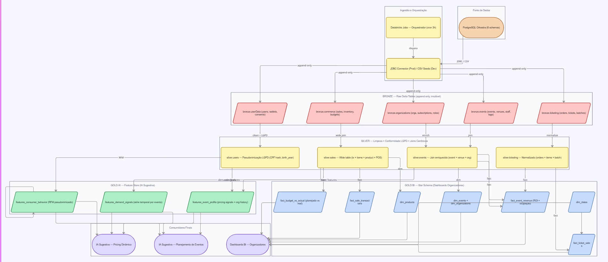

# Orkestra ETL Pipeline

> Medallion Architecture (Bronze → Silver → Gold) implementada em Databricks 
> Community Edition para a plataforma Orkestra de gestão de eventos.

## Stack
- Apache Spark 3.5 (PySpark)
- Delta Lake (Open Source)
- Databricks Community Edition

## Arquitetura

## Camadas
- **Bronze:** ingestão raw das PostgreSQL via arquivos CSV (JDBC + partição por data em versões futuras)
- **Silver:** limpeza, pseudonimização LGPD, joins canônicos
- **Gold BI:** Star Schema para dashboards de organizadores
- **Gold AI:** Feature Store para modelos de pricing e demanda

## Como rodar localmente
1. Clone o repo
2. Suba um cluster Databricks Community Edition
3. Faça upload dos CSVs em `/FileStore/orkestra/seeds/` ou `/Volumes/workspace/bronze/data_source/` caso esteja usando ambiente serverless
4. Execute o Job `full_refresh` ou rode os notebooks na ordem numerada